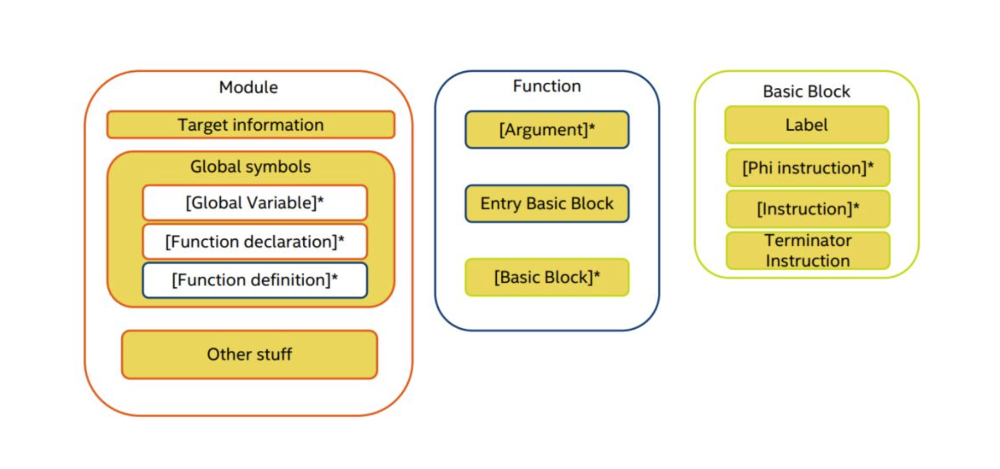

<div style="page-break-after: always;"></div>


<div style="page-break-after: always;"></div>

## 0.序言

### 0.1 概述

本次实验小组基于C++语言设计并实现了一个SPL语言的编译系统，该系统以符合SPL语言规范的代码文本文输入，输出为指定机器的目标代码。该SPL编译器的设计实现涵盖词法分析、语法分析、语义分析、优化考虑、代码生成等阶段和环节，所使用的具体技术包括但不限于：

- Flex实现词法分析
- Bison实现语法分析
- LLVM实现代码优化、中间代码生成、目标代码生成

### 0.2 开发环境

- 操作系统：Linux
- 编译环境：
  - Flex 2.6.4
  - bison (GNU Bison) 3.5.1
  - LLVM 9.0.1
- 编辑器：VScode

### 0.3 文件说明

本次实验提交的文件及其说明如下：

- CMakeLists.txt：定义编译链接规则
- scanner.l：lex，词法分析，生成token
- parser.y：yacc，实现语法分析，生成抽象语法树

- src：源代码文件夹

  - main.cpp：主程序
  - ast：抽象语法树
    - ast.hpp：定义了ast节点类的头文件
    - base.hpp：ast节点类的基类
    - decl.hpp：定义了DeclNode，VarDeclNode，ConstDeclNode，TypeDeclNode，ParamNode
    - expr.hpp：定义了BinaryExprNode，ArrayRefNode，RecordRefNode，ProcNode，CustomProcNode，SysProcNode
    - identifier.hpp：定义了IdentifierNode
    - program.hpp：定义了RoutineHeadNode，BaseRoutineNode，RoutineProc，RoutineNode，ProgramNode
    - stmt.hpp：定义了IfStmtNode，WhileStmtNode，ForStmtNode，RepeatStmtNode，ProcStmtNode，AssignStmtNode，CaseBranchNode，CaseStmtNode
    - type.hpp：定义了TypeNode，VoidTypeNode，SimpleTypeNode，StringTypeNode，AliasTypeNode，RecordTypeDecl，RecordTypeNode，ConstValueNode，BooleanNode，IntegerNode，RealNode，CharNode，StringNode，ArrayTypeNode
    - utils.hpp：定义了is_ptr_of和cast_node两个方法

  - codeGen：与代码生成相关的部分
    - codeGenContext.hpp 定义了一些与代码生成有关的东西，如module，builder，系统函数等
    - decl.cpp decl.hpp中各个类的方法的具体实现
    - expr.cpp expr.hpp中各个类的方法的具体实现
    - identifier.cpp identifier.hpp中各个类的方法的具体实现
    - program.cpp program.hpp中各个类的方法的具体实现
    - stmt.cpp stmt.hpp中各个类的方法的具体实现
    - type.cpp type.hpp中各个类的方法的具体实现

- doc：报告文档文件夹

  - report.pdf：报告文档

  - Slides.pdf：展示文档

- test：测试用例文件夹

  - course
  
  course.pas：选课助手测试代码
  
  linux-amd64-advisor：测试工具
  
  - matrix
  
  matrix.pas：矩阵乘法测试代码
  
  linux-amd64-matrix：测试工具
  
  - quicksort
  
  quicksort.pas：快排测试代码
  
  linux-amd64-quick：测试工具
  
  - Others
  
  rec.pas：record测试代码
  
  test.pas：一个简单测试
  
  write.pas：
  
  - clean.sh：一键删除所有测试程序生成的可执行程序及其它中间部分
  - gen.sh：一键生成测试程序的可执行程序

### 0.4 组员分工

| 组员   | 具体分工                              |
| :----- | :------------------------------------ |
| 杨一凡 | 测试代码、语法规则修改、expr          |
| 魏伯翼 | decl、identifier、program、stmt、type |
| 陶嘉辰 | main、scanner、parser                 |


## 第一章 词法分析

​	词法分析是计算机科学中将字符序列转换为标记（token）序列的过程。在词法分析阶段，编译器读入源程序字符串流，将字符流转换为标记序列，同时将所需要的信息存储，然后将结果交给语法分析器。

### 1.1 Lex

​	SPL编译器的词法分析使用Lex（Flex）完成，Lex是一个产生词法分析器的程序，是大多数UNIX系统的词法分析器产生程序。

​	Lex读入lex文件中定义的词法分析规则，输出C语言词法分析器源码。

​	标准lex文件由三部分组成，分别是定义区、规则区和用户子过程区。在定义区，用户可以编写C语言中的声明语句，导入需要的头文件或声明变量。在规则区，用户需要编写以正则表达式和对应的动作的形式的代码。在用户子过程区，用户可以定义函数。

```c
{definitions}
%%
{rules}
%%
{user subroutines}
```

### 1.2 正则表达式

正则表达式是通过单个字符串描述，匹配一系列符合某个句法规则的字符串。在实际应用中，常用到的语法规则如下

|   字符   |                             描述                             |
| :------: | :----------------------------------------------------------: |
|   `\`    | 将下一个字符标记为一个特殊字符（File Format Escape，清单见本表）、或一个原义字符（Identity Escape，有^$()*+?.[\{\|共计12个)、或一个向后引用（backreferences）、或一个八进制转义符。例如，“`n`”匹配字符“`n`”。“`\n`”匹配一个换行符。序列“`\\`”匹配“`\`”而“`\(`”则匹配“`(`”。 |
|   `^`    | 匹配输入字符串的开始位置。如果设置了RegExp对象的Multiline属性，^也匹配“`\n`”或“`\r`”之后的位置。 |
|   `$`    | 匹配输入字符串的结束位置。如果设置了RegExp对象的Multiline属性，$也匹配“`\n`”或“`\r`”之前的位置。 |
|   `*`    | 匹配前面的子表达式零次或多次。例如，zo*能匹配“`z`”、“`zo`”以及“`zoo`”。*等价于{0,}。 |
|   `+`    | 匹配前面的子表达式一次或多次。例如，“`zo+`”能匹配“`zo`”以及“`zoo`”，但不能匹配“`z`”。+等价于{1,}。 |
|   `?`    | 匹配前面的子表达式零次或一次。例如，“`do(es)?`”可以匹配“`does`”中的“`do`”和“`does`”。?等价于{0,1}。 |
|  `{n}`   | *n*是一个非负整数。匹配确定的*n*次。例如，“`o{2}`”不能匹配“`Bob`”中的“`o`”，但是能匹配“`food`”中的两个o。 |
|  `{n,}`  | *n*是一个非负整数。至少匹配*n*次。例如，“`o{2,}`”不能匹配“`Bob`”中的“`o`”，但能匹配“`foooood`”中的所有o。“`o{1,}`”等价于“`o+`”。“`o{0,}`”则等价于“`o*`”。 |
| `{n,m}`  | *m*和*n*均为非负整数，其中*n*<=*m*。最少匹配*n*次且最多匹配*m*次。例如，“`o{1,3}`”将匹配“`fooooood`”中的前三个o。“`o{0,1}`”等价于“`o?`”。请注意在逗号和两个数之间不能有空格。 |
|   `?`    | 非贪心量化（Non-greedy quantifiers）：当该字符紧跟在任何一个其他重复修饰符（*,+,?，{*n*}，{*n*,}，{*n*,*m*}）后面时，匹配模式是**非**贪婪的。非贪婪模式尽可能少的匹配所搜索的字符串，而默认的贪婪模式则尽可能多的匹配所搜索的字符串。例如，对于字符串“`oooo`”，“`o+?`”将匹配单个“`o`”，而“`o+`”将匹配所有“`o`”。 |
|   `.`    | 匹配除“`\r`”“`\n`”之外的任何单个字符。要匹配包括“`\r`”“`\n`”在内的任何字符，请使用像“`(.|\r|\n)`”的模式。 |
|  `x|y`   | 没有包围在()里，其范围是整个正则表达式。例如，“`z|food`”能匹配“`z`”或“`food`”。“`(?:z|f)ood`”则匹配“`zood`”或“`food`”。 |
| `[xyz]`  | 字符集合（character class）。匹配所包含的任意一个字符。例如，“`[abc]`”可以匹配“`plain`”中的“`a`”。特殊字符仅有反斜线\保持特殊含义，用于转义字符。其它特殊字符如星号、加号、各种括号等均作为普通字符。脱字符^如果出现在首位则表示负值字符集合；如果出现在字符串中间就仅作为普通字符。连字符 - 如果出现在字符串中间表示字符范围描述；如果如果出现在首位（或末尾）则仅作为普通字符。右方括号应转义出现，也可以作为首位字符出现。 |
| `[^xyz]` | 排除型字符集合（negated character classes）。匹配未列出的任意字符。例如，“`[^abc]`”可以匹配“`plain`”中的“`plin`”。 |
| `[a-z]`  | 字符范围。匹配指定范围内的任意字符。例如，“`[a-z]`”可以匹配“`a`”到“`z`”范围内的任意小写字母字符。 |
| `[^a-z]` | 排除型的字符范围。匹配任何不在指定范围内的任意字符。例如，“`[^a-z]`”可以匹配任何不在“`a`”到“`z`”范围内的任意字符。 |
|   `\d`   | 匹配一个数字字符。等价于[0-9]。注意Unicode正则表达式会匹配全角数字字符。 |
|   `\D`   |              匹配一个非数字字符。等价于[^0-9]。              |
|   `\n`   |              匹配一个换行符。等价于\x0a和\cJ。               |
|   `\r`   |              匹配一个回车符。等价于\x0d和\cM。               |
|   `\s`   | 匹配任何空白字符，包括空格、制表符、换页符等等。等价于[ \f\n\r\t\v]。注意Unicode正则表达式会匹配全角空格符。 |
|   `\S`   |          匹配任何非空白字符。等价于[^ \f\n\r\t\v]。          |
|   `\w`   | 匹配包括下划线的任何单词字符。等价于“`[A-Za-z0-9_]`”。注意Unicode正则表达式会匹配中文字符。 |
|   `\W`   |        匹配任何非单词字符。等价于“`[^A-Za-z0-9_]`”。         |

### 1.3 具体实现

#### 1.3.1 定义区

SPL的Lex源程序在定义区导入了需要的头文件等

```c
%{
#include<iostream>
#include<stdio.h>
#include<string>
#include<stdexcept>
#include "parser.hpp"
#include "ast/ast.hpp"

#undef YY_DECL
#define YY_DECL int yylex(spc::parser::semantic_type* lval, spc::parser::location_type* loc)
#define YY_USER_ACTION loc->step(); loc->columns(yyleng);

using token = spc::parser::token::yytokentype;
%}
```

#### 1.3.2 规则区

解析关键字、运算符和界符，由于运算符与界符是固定的，所以正则表达式只需要也是固定字符。

```c
"("     {return token::LP;}
")"     {return token::RP;}
"["     {return token::LB;}
"]"     {return token::RB;}
"."     {return token::DOT;}
".."    {return token::DOTDOT;}
";"     {return token::SEMI;}
","     {return token::COMMA;}
":"     {return token::COLON;}
"*"     {return token::MUL;}
"/"     {return token::TRUEDIV;}
"+"     {return token::PLUS;}
"-"     {return token::MINUS;}
">="    {return token::GE;}
">"     {return token::GT;}
"<="    {return token::LE;}
"<"     {return token::LT;}
"<>"    {return token::UNEQUAL;}
"="     {return token::EQUAL;}
":="    {return token::ASSIGN;}

"AND"       {  return token::AND;}
"ARRAY"     {  return token::ARRAY;}
"CASE"      {  return token::CASE;}
"CONST"     {  return token::CONST;}
"DIV"       {  return token::DIV;}
"MOD"       {  return token::MOD;}
"DO"        {  return token::DO;}
"DOWNTO"    {
      
    yylval->build<spc::ForDirection>(spc::ForDirection::Downto);
    return token::DOWNTO;
}
"ELSE"      {  return token::ELSE;}
"END"       {  return token::END;}
"FOR"       {  return token::FOR;}
"FUNCTION"  {  return token::FUNCTION;}
"GOTO"      {  return token::GOTO;}
"IF"        {  return token::IF;}
"NOT"       {  return token::NOT;}
"OF"        {  return token::OF;}
"OR"        {  return token::OR;}
"XOR"       {  return token::XOR;}
"BEGIN"     {  return token::PBEGIN;}
"PROCEDURE" {  return token::PROCEDURE;}
"PROGRAM"   {  return token::PROGRAM;}
"READLN"      {
      
    yylval->build<spc::SysFunc>(spc::SysFunc::Readln);
    return token::SYS_PROC;
}
"READ"      {
      
    yylval->build<spc::SysFunc>(spc::SysFunc::Read);
    return token::SYS_PROC;
}
"REPEAT"    {  return token::REPEAT;}
"THEN"      {  return token::THEN;}
"TO"        {
     
    yylval->build<spc::ForDirection>(spc::ForDirection::To); 
    return token::TO;
}
"TYPE"      {  return token::TYPE;}
"UNTIL"     {  return token::UNTIL;}
"VAR"       {  return token::VAR;}
"WHILE"     {  return token::WHILE;}
"RECORD"    {  return token::RECORD;}

"FALSE"     {
     
    yylval->build<std::shared_ptr<ConstValueNode>>(make_node<BooleanNode>(false)); 
    return token::SYS_CON;
}
"MAXINT"    {
     
    yylval->build<std::shared_ptr<ConstValueNode>>(make_node<IntegerNode>(std::numeric_limits<int>::max()));
    return token::SYS_CON;
}
"TRUE"      {
     
    yylval->build<std::shared_ptr<ConstValueNode>>(make_node<BooleanNode>(true)); 
    return token::SYS_CON;
}
"ABS"       {
     
    yylval->build<spc::SysFunc>(spc::SysFunc::Abs);
    return token::SYS_FUNCT;
}
"CHR"       {
     
    yylval->build<spc::SysFunc>(spc::SysFunc::Chr);
    return token::SYS_FUNCT;
}
"CONCAT"       {
     
    yylval->build<spc::SysFunc>(spc::SysFunc::Concat);
    return token::SYS_FUNCT;
}
"LENGTH"       {
     
    yylval->build<spc::SysFunc>(spc::SysFunc::Length);
    return token::SYS_FUNCT;
}
"ODD"       {
     
    yylval->build<spc::SysFunc>(spc::SysFunc::Odd);
    return token::SYS_FUNCT;
}
"ORD"       {
     
    yylval->build<spc::SysFunc>(spc::SysFunc::Ord);
    return token::SYS_FUNCT;
}
"PRED"      {
         
    yylval->build<spc::SysFunc>(spc::SysFunc::Pred);
    return token::SYS_FUNCT;
}
"SQR"       {
     
    yylval->build<spc::SysFunc>(spc::SysFunc::Sqr);
    return token::SYS_FUNCT;
}
"SQRT"      {
     
    yylval->build<spc::SysFunc>(spc::SysFunc::Sqrt);
    return token::SYS_FUNCT;
}
"STR"      {
     
    yylval->build<spc::SysFunc>(spc::SysFunc::Str);
    return token::SYS_FUNCT;
}
"SUCC"      {
     
    yylval->build<spc::SysFunc>(spc::SysFunc::Succ);
    return token::SYS_FUNCT;
}
"VAL"     {
     
    yylval->build<spc::SysFunc>(spc::SysFunc::Val);
    return token::SYS_FUNCT;
}
"WRITE"     {
     
    yylval->build<spc::SysFunc>(spc::SysFunc::Write);
    return token::SYS_PROC;
}
"WRITELN"   {
     
    yylval->build<spc::SysFunc>(spc::SysFunc::Writeln);
    return token::SYS_PROC;
}

"BOOLEAN"   {
     
    yylval->build<std::shared_ptr<SimpleTypeNode>>(make_node<SimpleTypeNode>(spc::Type::Bool));
    return token::SYS_TYPE;
}
"CHAR"      {
     
    yylval->build<std::shared_ptr<SimpleTypeNode>>(make_node<SimpleTypeNode>(spc::Type::Char));  
    return token::SYS_TYPE;
}
"INTEGER"   {
     
    yylval->build<std::shared_ptr<SimpleTypeNode>>(make_node<SimpleTypeNode>(spc::Type::Int)); 
    return token::SYS_TYPE;
}
"LONGINT"   {
     
    yylval->build<std::shared_ptr<SimpleTypeNode>>(make_node<SimpleTypeNode>(spc::Type::Long)); 
    return token::SYS_TYPE;
}
"REAL"      {
     
    yylval->build<std::shared_ptr<SimpleTypeNode>>(make_node<SimpleTypeNode>(spc::Type::Real)); 
    return token::SYS_TYPE;
}
"STRING"    {
     
    return token::STR_TYPE;
}
```

标识符是由字母或下划线开头，由字母、数字和下划线组成的字符串，并且不能是关键字、SYS_CON、SYS_FUNCT 、SYS_PROC、SYS_TYPE之外的ID。SPL编译器在词法分析阶段只校验是否符合标识符规则，而不校验是否存在。不同于运算符，标识符需要额外保存字符串值。

```c
[+-]?[0-9]+      {
   
    yylval->build<std::shared_ptr<IntegerNode>>(make_node<IntegerNode>(atoi(yytext))); 
    return token::INTEGER;
}
[+-]?[0-9]+"."[0-9]+("e"[+-]?[0-9]+)?   {

    yylval->build<std::shared_ptr<RealNode>>(make_node<RealNode>(atof(yytext))); 
    return token::REAL;
}
'{NQUOTE}'  {

    yylval->build<std::shared_ptr<CharNode>>(make_node<CharNode>(yytext[1])); 
    return token::CHAR;
}
'({NQUOTE}|'')+'  {
 
    yytext[yyleng-1] = 0; 
    yylval->build<std::shared_ptr<StringNode>>(make_node<StringNode>(yytext + 1)); 
    return token::STRING;
}
[a-zA-Z_]([a-zA-Z0-9_])*  {

    yytext[yyleng] = 0;
    yylval->build<std::shared_ptr<IdentifierNode>>(make_node<IdentifierNode>(yytext));  
    return token::ID;
}
[ \t\f]    { continue;}
[\n\r]     {loc->lines();}
```

然后其他一些如注释符等：

```c
"(*" {
    char c;
    while(c = yyinput()) 
    {
        if (c == '\n') loc->lines();
        else if(c == '*') 
        {
            if((c = yyinput()) == ')')
                break;
            else unput(c);
        }
    }
}
"{" {
    char c;
    while(c = yyinput()) 
    {
        if (c == '\n') loc->lines();
        else if(c == '}') break;
    }
}
"//" {
    char c;
    while(c = yyinput()) 
    {
        if(c == '\n') 
        {
            loc->lines();
            break;
        }
        else if(c == EOF) {
            break;
        }
    }
}

. {
    std::cerr << std::endl << "Scanner: Error at " << *loc << ":" << std::endl;
    throw std::invalid_argument(std::string("Invalid token \'") + yytext + "\'");
}
```

## 第二章 语法分析

​	在计算机科学和语言学中，语法分析是根据某种给定的形式文法对由单词序列（如英语单词序列）构成的输入文本进行分析并确定其语法结构的一种过程。在词法分析阶段，编译器接收词法分析器发送的标记序列，最终输出抽象语法树数据结构。

### 2.1 Yacc

SPL编译器的语法分析使用Yacc（Bison）完成。Yacc是Unix/Linux上一个用来生成编译器的编译器（编译器代码生成器）。Yacc生成的编译器主要是用C语言写成的语法解析器（Parser），需要与词法解析器Lex一起使用，再把两部分产生出来的C程序一并编译。

与Lex相似，Yacc的输入文件由以%%分割的三部分组成，分别是声明区、规则区和程序区。三部分的功能与Lex相似，不同的是规则区的正则表达式替换为CFG，在声明区要提前声明好使用到的终结符以及非终结符的类型。

```c
  declarations
  %%
  rules
  %%
  programs
```

### 2.2 抽象语法树

语法分析器的输出是抽象语法树。在计算机科学中，抽象语法树是源代码语法结构的一种抽象表示。它以树状的形式表现编程语言的语法结构，树上的每个节点都表示源代码中的一种结构。之所以说语法是“抽象”的，是因为这里的语法并不会表示出真实语法中出现的每个细节。比如，嵌套括号被隐含在树的结构中，并没有以节点的形式呈现；而类似于 if-condition-then 这样的条件跳转语句，可以使用带有三个分支的节点来表示。

#### 2.2.1 BaseNode类

BaseNode类是一个抽象类，其意义为"抽象语法树的节点"，这是抽象语法树所有节点（在下文简称AST）的共同祖先。该类拥有一个纯虚函数codegen，分别用于生成中间代码。

```cpp
class BaseNode
    {
    public:
        BaseNode() {}
        ~BaseNode() {}
        virtual llvm::Value *codegen(CodegenContext &) = 0;
    };
```

#### 2.2.2 ListNode类

ListNode类继承自BaseNode类，有一个私有成员children，同时定义了getChildren，append，merge，mergeList，codegen等方法。

```cpp
class ListNode: public BaseNode
    {
    private:
        std::list<std::shared_ptr<T>> children;
    public:
        ListNode() {}
        ListNode(const std::shared_ptr<T> &val) { children.push_back(val); }
        ListNode(std::shared_ptr<T> &&val) { children.push_back(val); }
        ~ListNode() {}

        std::list<std::shared_ptr<T>> &getChildren() { return children; }

        void append(const std::shared_ptr<T> &val) { children.push_back(val); }
        void append(std::shared_ptr<T> &&val) { children.push_back(val); }

        void merge(const std::shared_ptr<ListNode<T>> &rhs)
        {
            for (auto &c: rhs->children)
                children.push_back(c);
        }
        void merge(std::shared_ptr<ListNode<T>> &&rhs)
        {
            children.merge(std::move(rhs->children));
        }
        void mergeList(const std::list<std::shared_ptr<T>> &lst)
        {
            for (auto &c: lst)
                children.push_back(c);
        }
        void mergeList(std::list<std::shared_ptr<T>> &&lst)
        {
            children.merge(std::move(lst));
        }
        virtual llvm::Value *codegen(CodegenContext &context)
        {
            for (auto &c : children)
                c->codegen(context);
        }
    };
```

#### 2.2.3 ExprNode类

ExprNode类继承自BaseNode，是许多其它node类的父类

```cpp
class ExprNode: public BaseNode
    {
    public:
        ExprNode() {}
        ~ExprNode() {}
        virtual llvm::Value *codegen(CodegenContext &context) = 0;
    };
```

#### 2.2.4 LeftExprNode类

LeftExprNode类继承自ExprNode，定义了codegen，getPtr，getAssignPtr，getSymbolName方法。

```c++
class LeftExprNode: public ExprNode
    {
    public:
        LeftExprNode() {}
        ~LeftExprNode() = default;
        virtual llvm::Value *codegen(CodegenContext &context) = 0;
        virtual llvm::Value *getPtr(CodegenContext &context) = 0;
        virtual llvm::Value *getAssignPtr(CodegenContext &context) = 0;
        virtual const std::string getSymbolName() = 0;
    };
```

#### 2.2.5 StmtNode类

StmtNode类也是许多类的父类，继承自BaseNode类。

```c++
class StmtNode: public BaseNode
    {
    public:
        StmtNode() {}
        ~StmtNode() {}
        virtual llvm::Value *codegen(CodegenContext &context) = 0;
    };
```

#### 2.2.6 变量声明

decl.hpp中定义了许多与声明有关的类

DeclNode类继承自BaseNode类，是声明相关的所有类的父类

```c++
class DeclNode: public BaseNode
    {
    public:
        DeclNode() {}
        ~DeclNode() = default;
    };
```

VarDeclNode类继承自DeclNode类，用于变量声明，有一个name成员和一个type成员，同时定义了构造函数，析构函数，codegen，createGlobalArray和createArray。

```c++
class VarDeclNode: public DeclNode
    {
    private:
        std::shared_ptr<IdentifierNode> name;
        std::shared_ptr<TypeNode> type;
    public:
        VarDeclNode(const std::shared_ptr<IdentifierNode>& name, const std::shared_ptr<TypeNode>& type) : name(name), type(type) {}
        ~VarDeclNode() = default;

        llvm::Value *codegen(CodegenContext &) override;
        friend class RecordTypeNode;
        friend class RecordTypeDecl;
        llvm::Value *createGlobalArray( CodegenContext &context, const std::shared_ptr<ArrayTypeNode> &);
        llvm::Value *createArray(CodegenContext &context, const std::shared_ptr<ArrayTypeNode> &);
        friend class CodegenContext;
    };
```

ConstDeclNode继承自DeclNode，用于常量声明，有一个name成员和val成员。

```c++
class ConstDeclNode: public DeclNode
    {
    private:
        std::shared_ptr<IdentifierNode> name;
        std::shared_ptr<ConstValueNode> val;
    public:
        ConstDeclNode(const std::shared_ptr<IdentifierNode>& name, const std::shared_ptr<ConstValueNode>& val) : name(name), val(val) {}
        ~ConstDeclNode() = default;

        llvm::Value *codegen(CodegenContext &) override;
    };
```

TypeDeclNode继承自DeclNode，用于类型声明，有一个name成员和type成员：

```c++
class TypeDeclNode: public DeclNode
    {
    private:
        std::shared_ptr<IdentifierNode> name;
        std::shared_ptr<TypeNode> type;
    public:
        TypeDeclNode(const std::shared_ptr<IdentifierNode>& name, const std::shared_ptr<TypeNode>& type) : name(name), type(type) {}
        ~TypeDeclNode() = default;

        llvm::Value *codegen(CodegenContext &) override;
    };
```

ParamNode用于声明参数，有name成员和type成员:

```c++
class ParamNode: public DeclNode
    {
    private:
        std::shared_ptr<IdentifierNode> name;
        std::shared_ptr<TypeNode> type;
    public:
        ParamNode(const std::shared_ptr<IdentifierNode>& name, const std::shared_ptr<TypeNode>& type) : name(name), type(type) {}
        ~ParamNode() = default;

        llvm::Value *codegen(CodegenContext &) override { return nullptr; }
        friend class RoutineNode;
        friend class RoutineProc;
    };
```

#### 2.2.7表达式

expr.hpp中的类基本上都继承自ExprNode和LeftExprNode。

BinaryExprNode定义了二元运算表达式，有一个运算符成员op，一个左表达式成员lhs，一个右表达式成员rhs

```c++
class BinaryExprNode: public ExprNode
    {
    private:
        BinaryOp op;
        std::shared_ptr<ExprNode> lhs, rhs;
    public:
        BinaryExprNode(
            const BinaryOp op, 
            const std::shared_ptr<ExprNode>& lval, 
            const std::shared_ptr<ExprNode>& rval
            ) 
            : op(op), lhs(lval), rhs(rval) {}
        ~BinaryExprNode() = default;

        llvm::Value *codegen(CodegenContext &) override;
    };
```

ArrayRefNode定义了Array类型的表达式，有一个arr成员与一个index成员：

```c++
class ArrayRefNode: public LeftExprNode
    {
    private:
        std::shared_ptr<LeftExprNode> arr;
        std::shared_ptr<ExprNode> index;
    public:
        ArrayRefNode(const std::shared_ptr<LeftExprNode> &arr, const std::shared_ptr<ExprNode> &index)
            : arr(arr), index(index) {}
        ~ArrayRefNode() = default;

        llvm::Value *codegen(CodegenContext &) override;
        llvm::Value *getPtr(CodegenContext &) override;
        llvm::Value *getAssignPtr(CodegenContext &) override;
        const std::string getSymbolName() override;
        friend class AssignStmtNode;
    };
```

RecordRefNode类定义了Record表达式，有一个name成员与一个field成员。

```c++
class RecordRefNode: public LeftExprNode
    {
    private:
        std::shared_ptr<LeftExprNode> name;
        std::shared_ptr<IdentifierNode> field;
    public:
        RecordRefNode(const std::shared_ptr<LeftExprNode> &name, const std::shared_ptr<IdentifierNode> &field)
            : name(name), field(field) {}
        ~RecordRefNode() = default;

        llvm::Value *codegen(CodegenContext &) override;
        llvm::Value *getPtr(CodegenContext &) override;
        llvm::Value *getAssignPtr(CodegenContext &) override;
        const std::string getSymbolName() override;
    };
```

ProcNode类用于procedure

```c++
class ProcNode: public ExprNode
    {
    public:
        ProcNode() = default;
        ~ProcNode() = default;
        llvm::Value *codegen(CodegenContext &context) = 0;
    };
```

CustomProcNode继承自ProcNode类

```c++
class CustomProcNode: public ProcNode
    {
    private:
        std::shared_ptr<IdentifierNode> name;
        std::shared_ptr<ArgList> args;
    public:
        CustomProcNode(const std::string &name, const std::shared_ptr<ArgList> &args = nullptr) 
            : name(make_node<IdentifierNode>(name)), args(args) {}
        CustomProcNode(const std::shared_ptr<IdentifierNode> &name, const std::shared_ptr<ArgList> &args = nullptr) 
            : name(name), args(args) {}
        ~CustomProcNode() = default;

        llvm::Value *codegen(CodegenContext &context) override;
    };
```

SysProcNode类用于系统函数

```c++
class SysProcNode: public ProcNode
    {
    private:
        SysFunc name;
        std::shared_ptr<ArgList> args;
    public:
        SysProcNode(const SysFunc name, const std::shared_ptr<ArgList> &args = nullptr) 
            : name(name), args(args) {}
        ~SysProcNode() = default;

        llvm::Value *codegen(CodegenContext &context) override;
    };
```

#### 2.2.8 标识符

IdentifierNode继承自LeftExprNode，定义了标识符

```c++
class IdentifierNode: public LeftExprNode   //ID 表示变量，成员name为变量名
    {      
    public:
        std::string name;
        IdentifierNode(const std::string &str)  //用string构造
            : name(str) 
        {
            std::transform(name.begin(), name.end(), name.begin(), ::tolower); //不分大小写，全部转化成小写 
        }
        IdentifierNode(const char *str)   //用变量char*构造
            : name(str) 
        {
            std::transform(name.begin(), name.end(), name.begin(), ::tolower); //不分大小写，全部转化成小写 
        }
        ~IdentifierNode() = default;

        llvm::Value *codegen(CodegenContext &context) override;  //中间代码生成
        llvm::Constant *getConstVal(CodegenContext &context);   //
        llvm::Value *getPtr(CodegenContext &context) override;  //
        llvm::Value *getAssignPtr(CodegenContext &context) override;  //
        const std::string getSymbolName() override { return this->name; } //返回变量名
    };

    using IdentifierList = ListNode<IdentifierNode>;

} 
```

#### 2.2.9 函数声明

RoutineHeadNode定义了函数头，有成员：constList 常量列表，varList 变量列表，typeList 类型列表，subroutineList 子过程列表

```c++
class RoutineHeadNode: public BaseNode  //函数头
    {
    private:
        std::shared_ptr<ConstDeclList> constList;  //常量列表
        std::shared_ptr<VarDeclList> varList;      //变量列表
        std::shared_ptr<TypeDeclList> typeList;    //类型列表
        std::shared_ptr<RoutineList> subroutineList; //子过程列表
    public:
        RoutineHeadNode(
            const std::shared_ptr<ConstDeclList> &constList,
            const std::shared_ptr<VarDeclList> &varList,
            const std::shared_ptr<TypeDeclList> &typeList,
            const std::shared_ptr<RoutineList> &subroutineList
            )
            : constList(constList), varList(varList), typeList(typeList), subroutineList(subroutineList) {}
        ~RoutineHeadNode() = default;

        llvm::Value *codegen(CodegenContext &) override { return nullptr; } //代码生成
        friend class ProgramNode;
        friend class RoutineNode;
        friend class RoutineProc;
    };
```

BaseRoutineNode定义了函数，有成员：name，header，body

```c++
class BaseRoutineNode: public BaseNode  //函数
    {
    protected:
        std::shared_ptr<IdentifierNode> name;  //函数名
        std::shared_ptr<RoutineHeadNode> header; //函数头
        std::shared_ptr<CompoundStmtNode> body; //函数体
    public:
        BaseRoutineNode(const std::shared_ptr<IdentifierNode> &name, const std::shared_ptr<RoutineHeadNode> &header, const std::shared_ptr<CompoundStmtNode> &body)
            : name(name), header(header), body(body) {}
        ~BaseRoutineNode() = default;

        std::string getName() const { return name->name; } //返回函数名
        llvm::Value *codegen(CodegenContext &) = 0; //中间代码生成
    };
```

RoutineProc继承自BaseRoutineNode，无返回值，有params 参数表 成员：

```c++
class RoutineProc: public BaseRoutineNode  //函数
    {
    private:
        std::shared_ptr<ParamList> params;    //变量
    public:
        RoutineProc(
            const std::shared_ptr<IdentifierNode> &name, 
            const std::shared_ptr<RoutineHeadNode> &header, 
            const std::shared_ptr<CompoundStmtNode> &body, 
            const std::shared_ptr<ParamList> &params
            )
            : BaseRoutineNode(name, header, body), params(params) {}
        ~RoutineProc() = default;

        llvm::Value *codegen(CodegenContext &) override;

        std::shared_ptr<IdentifierNode> getname(){  //返回函数名
            return this->name;
        }
        std::shared_ptr<RoutineHeadNode> getheader(){  //返回函数头
            return this->header;
        }
        std::shared_ptr<CompoundStmtNode> getbody(){ //返回函数体
            return this->body;
        }
        std::shared_ptr<ParamList> getparams(){  //返回变量
            return this->params;
        }
    };
```

RoutineNode继承自BaseRoutineNode，有返回值：

```c++
    class RoutineNode: public BaseRoutineNode
    {
    private:
        std::shared_ptr<ParamList> params;  //变量
        std::shared_ptr<TypeNode> retType;  //返回值
    public:
        RoutineNode(
            const std::shared_ptr<IdentifierNode> &name, 
            const std::shared_ptr<RoutineHeadNode> &header, 
            const std::shared_ptr<CompoundStmtNode> &body, 
            const std::shared_ptr<ParamList> &params, 
            const std::shared_ptr<TypeNode> &retType
            )
            : BaseRoutineNode(name, header, body), params(params), retType(retType) {}
        /*RoutineNode(
            std::shared_ptr<RoutineProc> node
            )
            : BaseRoutineNode(node->getname(),node->getheader(),node->getbody()), params(node->getparams()), retType(node->getretType()) {}*/
        ~RoutineNode() = default;

        llvm::Value *codegen(CodegenContext &) override;

        std::shared_ptr<IdentifierNode> getname(){  //返回函数名
            return this->name;
        }
        std::shared_ptr<RoutineHeadNode> getheader(){  //返回函数头
            return this->header;
        }
        std::shared_ptr<CompoundStmtNode> getbody(){ //返回函数体
            return this->body;
        }
        std::shared_ptr<ParamList> getparams(){  //返回变量
            return this->params;
        }
        std::shared_ptr<TypeNode> getretType(){  //返回return值
            return this->retType;
        }
    };
```

ProgramNode作为program的初始结点，不保存任何类型信息

```c++
class ProgramNode: public BaseRoutineNode  //作为program的初始结点，不保存任何类型信息
    {
    public:
        using BaseRoutineNode::BaseRoutineNode;
        ~ProgramNode() = default;

        llvm::Value *codegen(CodegenContext &) override;
    };   
```

#### 2.2.10 语句

stmt.hpp中定义了许多语句，如if else语句，while语句等

IfStmtNode继承自StmtNode，定义了if语句，有成员：expr 判断式，if_stmt 如果为真执行语句，else_stmt如果为假执行语句

```c++
class IfStmtNode: public StmtNode    //IF语句
    {
    private:
        std::shared_ptr<ExprNode> expr; //判断式
        std::shared_ptr<CompoundStmtNode> if_stmt; //如果为真执行语句
        std::shared_ptr<CompoundStmtNode> else_stmt; //如果为假执行语句
    public:
        IfStmtNode(              //构造函数
            const std::shared_ptr<ExprNode> &expr, 
            const std::shared_ptr<CompoundStmtNode> &if_stmt, 
            const std::shared_ptr<CompoundStmtNode> &else_stmt = nullptr
            ) 
            : expr(expr), if_stmt(if_stmt), else_stmt(else_stmt) {}
        ~IfStmtNode() = default;

        llvm::Value *codegen(CodegenContext &context) override; //生成中间代码
    };
```

WhileStmtNode定义了while语句，有成员：expr 判断条件，stmt 执行语句。

```c++
class WhileStmtNode: public StmtNode  //while语句
    {
    private:
        std::shared_ptr<ExprNode> expr;   //判断式
        std::shared_ptr<CompoundStmtNode> stmt;     //执行语句
    public:
        WhileStmtNode(           //构造函数
            const std::shared_ptr<ExprNode> &expr, 
            const std::shared_ptr<CompoundStmtNode> &stmt
            )
            : expr(expr), stmt(stmt) {}
        ~WhileStmtNode() = default;

        llvm::Value *codegen(CodegenContext &context) override;
    };
```

ForDirection定义了for语句，我们定义的for语句不能自定义步长，步长恒定为1

```c++
class ForStmtNode: public StmtNode  //for语句，步长恒定为1
    {
    private:
        ForDirection direction; //迭代方向
        std::shared_ptr<IdentifierNode> id; //循环变量名
        std::shared_ptr<ExprNode> init_val; //变量初始值
        std::shared_ptr<ExprNode> end_val; //变量结束值
        std::shared_ptr<CompoundStmtNode> stmt; //执行语句
    public:
        ForStmtNode(              //构造函数
            const ForDirection dir,
            const std::shared_ptr<IdentifierNode> &id, 
            const std::shared_ptr<ExprNode> &init_val, 
            const std::shared_ptr<ExprNode> &end_val, 
            const std::shared_ptr<CompoundStmtNode> &stmt
            )
            : direction(dir), id(id), init_val(init_val), end_val(end_val), stmt(stmt) {}
        ~ForStmtNode() = default;

        llvm::Value *codegen(CodegenContext &context) override;
    };
```

RepeatStmtNode定义了repeat语句，有成员：expr 判断条件，stmt 执行语句

```c++
class RepeatStmtNode: public StmtNode //do while语句
    {
    private:
        std::shared_ptr<ExprNode> expr; //判断式
        std::shared_ptr<CompoundStmtNode> stmt; //执行语句
    public:
        RepeatStmtNode( //构造函数
            const std::shared_ptr<ExprNode> &expr, 
            const std::shared_ptr<CompoundStmtNode> &stmt
            )
            : expr(expr), stmt(stmt) {}
        ~RepeatStmtNode() = default;

        llvm::Value *codegen(CodegenContext &context) override; //中间代码生成
    };
```

AssignStmtNode定义了赋值语句：

```c++
class AssignStmtNode: public StmtNode //赋值语句
    {
    private:
        std::shared_ptr<LeftExprNode> lhs;  //左值
        std::shared_ptr<ExprNode> rhs;    //右值
    public:
        AssignStmtNode(const std::shared_ptr<LeftExprNode> &lhs, const std::shared_ptr<ExprNode> &rhs) //构造函数
            : lhs(lhs), rhs(rhs)
        {}
        ~AssignStmtNode() = default;

        llvm::Value *codegen(CodegenContext &context) override;//中间代码生成
    };
```

其它如case语句等不再赘述。

#### 2.2.11 类型

TypeNode为所有type的基类

```c++
class TypeNode: public BaseNode  //复杂类型的基类
    {
    public:
        Type type;  //类型
        TypeNode(const Type type = Unknown) : type(type) {}
        ~TypeNode() {}
        llvm::Value *codegen(CodegenContext &) override { return nullptr; };
        virtual llvm::Type *getLLVMType(CodegenContext &) = 0;
    };
```

VoidTypeNode定义了空类型

```c++
class VoidTypeNode: public TypeNode //空类型
    {
    public:
        VoidTypeNode() : TypeNode(Type::Void) {}
        ~VoidTypeNode() = default;
        llvm::Type *getLLVMType(CodegenContext &context) override ;
    };
```

SimpleTypeNode定义了简单类型

```c++
class SimpleTypeNode: public TypeNode //简单类型（用于系统函数）
    {
    public:
        SimpleTypeNode(const Type type) : TypeNode(type) {}
        ~SimpleTypeNode() = default;
        llvm::Type *getLLVMType(CodegenContext &) override;
    };
```

StringTypeNode定义了string类型

```c++
class StringTypeNode: public TypeNode //String类型
    {
    public:
        StringTypeNode() : TypeNode(Type::String) {}
        ~StringTypeNode() = default;
        llvm::Type *getLLVMType(CodegenContext &context) override;
    };
```

其它如constVal等不再赘述。

### 2.3 语法分析的具体实现

首先在声明区声明好终结符和非终结符类型

```c
%token PROGRAM ID CONST ARRAY VAR FUNCTION PROCEDURE PBEGIN END TYPE RECORD
%token INTEGER REAL CHAR STRING
%token SYS_CON SYS_FUNCT SYS_PROC SYS_TYPE STR_TYPE
%token IF THEN ELSE REPEAT UNTIL WHILE DO FOR TO DOWNTO CASE OF GOTO
%token ASSIGN EQUAL UNEQUAL LE LT GE GT
%token PLUS MINUS MUL DIV MOD TRUEDIV AND OR XOR NOT
%token DOT DOTDOT SEMI LP RP LB RB COMMA COLON

%type <std::shared_ptr<IntegerNode>> INTEGER
%type <std::shared_ptr<RealNode>> REAL
%type <std::shared_ptr<CharNode>> CHAR
%type <std::shared_ptr<StringNode>> STRING
%type <std::shared_ptr<IdentifierNode>> ID
%type <std::shared_ptr<SimpleTypeNode>> SYS_TYPE
%type <spc::SysFunc> SYS_PROC SYS_FUNCT
%type <spc::ForDirection> TO DOWNTO
%type <std::shared_ptr<ConstValueNode>> SYS_CON

%type <std::shared_ptr<ProgramNode>> program
%type <std::shared_ptr<RoutineHeadNode>> routine_head

%type <std::shared_ptr<RoutineList>> routine_part 

%type <std::shared_ptr<RoutineNode>> function_decl 
%type <std::shared_ptr<RoutineProc>> procedure_decl

%type <std::shared_ptr<ConstDeclList>> const_part const_expr_list
%type <std::shared_ptr<TypeDeclList>> type_part type_decl_list
%type <std::shared_ptr<VarDeclList>> var_part var_decl_list var_decl
%type <std::shared_ptr<ConstValueNode>> const_value

%type <std::shared_ptr<TypeNode>> type_decl simple_type_decl

%type <std::shared_ptr<StringTypeNode>> string_type_decl
%type <std::shared_ptr<ArrayTypeNode>> array_type_decl
%type <std::pair<std::shared_ptr<IdentifierList>, std::shared_ptr<TypeNode>>> field_decl

%type <std::shared_ptr<RecordTypeNode>>  field_decl_list 
%type <std::shared_ptr<RecordTypeDecl>> record_type_decl 

%type <std::pair<std::shared_ptr<ExprNode>, std::shared_ptr<ExprNode>>> array_range
%type <std::shared_ptr<TypeDeclNode>> type_definition 
%type <std::shared_ptr<IdentifierList>> name_list var_para_list
%type <std::shared_ptr<ParamList>> parameters para_decl_list para_type_list
%type <std::shared_ptr<AssignStmtNode>> assign_stmt
%type <std::shared_ptr<ProcStmtNode>> proc_stmt
%type <std::shared_ptr<CompoundStmtNode>> compound_stmt stmt_list stmt else_clause routine_body
%type <std::shared_ptr<IfStmtNode>> if_stmt
%type <std::shared_ptr<RepeatStmtNode>> repeat_stmt
%type <std::shared_ptr<WhileStmtNode>> while_stmt
%type <std::shared_ptr<ForStmtNode>> for_stmt
%type <spc::ForDirection> direction
%type <std::shared_ptr<CaseStmtNode>> case_stmt
%type <std::shared_ptr<CaseBranchList>> case_expr_list
%type <std::shared_ptr<CaseBranchNode>> case_expr
%type <std::shared_ptr<LeftExprNode>> left_expr
%type <std::shared_ptr<ExprNode>> expression expr term factor
%type <std::shared_ptr<ArgList>> args_list
```

接着按从下往上的顺序构造语法树，部分文法如下：

```c
%start program

%%

program: PROGRAM ID SEMI routine_head routine_body DOT{
        program = make_node<ProgramNode>($2, $4, $5);
    }
    ;

routine_head: const_part type_part var_part routine_part {
        $$ = make_node<RoutineHeadNode>($1, $3, $2, $4);
    }
    ;

const_part: CONST const_expr_list { $$=$2; }
    | { $$ = make_node<ConstDeclList>(); }
    ;

const_expr_list: const_expr_list ID EQUAL const_value SEMI  {
        $$ = $1; $$->append(make_node<ConstDeclNode>($2, $4));
    }
    | ID EQUAL const_value SEMI {
        $$ = make_node<ConstDeclList>(make_node<ConstDeclNode>($1, $3));
    }
    ;

const_value: INTEGER {$$ = $1;}
    | REAL    {$$ = $1;}
    | CHAR    {$$ = $1;}
    | STRING  {$$ = $1;}
    | SYS_CON {$$ = $1;}
    ;

type_part: TYPE type_decl_list {$$ = $2;}
    | {$$ = make_node<TypeDeclList>();}
    ;

type_decl_list: type_decl_list type_definition {
        $$ = $1; $$->append($2);
    }
    | type_definition {
        $$ = make_node<TypeDeclList>($1);
    }
    ;

type_definition: ID EQUAL type_decl SEMI {
        $$ = make_node<TypeDeclNode>($1, $3);
    }
    ;

type_decl: simple_type_decl {
        $$ = $1;
    }
    | array_type_decl {$$ = $1;}
    ;

simple_type_decl: SYS_TYPE {$$ = $1;}
    | ID {$$ = make_node<AliasTypeNode>($1);}
    | string_type_decl {$$ = $1;}
    | record_type_decl {$$ = make_node<RecordTypeNode>($1);}
    ;

array_type_decl: ARRAY LB array_range RB OF type_decl {
        $$ = make_node<ArrayTypeNode>($3.first, $3.second, $6);
    }
    ;

string_type_decl: STR_TYPE {
        $$ = make_node<StringTypeNode>();
    }
    ;

array_range: const_value DOTDOT const_value { 
        if (!is_ptr_of<IntegerNode>($1) || !is_ptr_of<IntegerNode>($3)) throw std::logic_error("\nArray index must be integer!");
        $$ = std::make_pair($1, $3);
    }
    | ID DOTDOT ID { 
        $$ = std::make_pair($1, $3);
    }
    ;

record_type_decl: RECORD field_decl_list END {
        $$ = make_node<RecordTypeDecl>($2->getfield());
    }
    ;

field_decl_list: field_decl_list field_decl {
        $$ = $1; $$->merge(make_node<RecordTypeNode>($2.first, $2.second));
    }
    | field_decl {$$ = make_node<RecordTypeNode>($1.first, $1.second);}
    ;

field_decl: name_list COLON type_decl SEMI {
        $$ = std::make_pair($1, $3);
    }
    ;

name_list: name_list COMMA ID {
        $$ = $1; $$->append($3);
    }
    | ID {$$ = make_node<IdentifierList>($1);}
    ;

var_part: VAR var_decl_list {$$ = $2;}
    | {$$ = make_node<VarDeclList>();}
    ;

var_decl_list: var_decl_list var_decl {
        $$ = $1; $$->merge(std::move($2));
    }
    | var_decl {$$ = $1;}
    ;

var_decl: name_list COLON type_decl SEMI {
        $$ = make_node<VarDeclList>();
        for (auto &name : $1->getChildren()) $$->append(make_node<VarDeclNode>(name, $3));
    }
    ;

routine_part: routine_part function_decl { 
        $$ = $1; $$->append($2);
    }
    | routine_part procedure_decl {$$ = $1; $$->append($2);}
    | {$$ = make_node<RoutineList>();}
    ;

function_decl: FUNCTION ID parameters COLON simple_type_decl SEMI routine_head routine_body SEMI {
    $$ = make_node<RoutineNode>($2, $7, $8, $3, $5); 
    }
    ;

procedure_decl: PROCEDURE ID parameters SEMI routine_head routine_body SEMI {
        $$ = make_node<RoutineProc>($2, $5, $6, $3);
    }
    ;

parameters: LP para_decl_list RP { $$ = $2; }
    | LP RP { $$ = make_node<ParamList>(); }
    | { $$ = make_node<ParamList>(); }
    ;

para_decl_list: para_decl_list SEMI para_type_list {
        $$ = $1; $$->merge(std::move($3));
    }
    | para_type_list {$$ = $1;}
    ;

para_type_list: var_para_list COLON type_decl /*simple_type_decl*/ {
        $$ = make_node<ParamList>();
        for (auto &name : $1->getChildren()) $$->append(make_node<ParamNode>(name, $3));
    }
    ;

var_para_list: VAR name_list {
        $$ = $2;
    }
    | name_list {$$ = $1;}
    ;

routine_body: compound_stmt {
        $$ = $1;
    }
    ;

compound_stmt: PBEGIN stmt_list END {
        $$ = $2;
    }
    ;

stmt_list: stmt_list stmt SEMI {
        $$ = $1; $$->merge(std::move($2));
    }
    | { $$ = make_node<CompoundStmtNode>(); }
    ;

stmt: assign_stmt {$$ = make_node<CompoundStmtNode>($1);}
    | proc_stmt {$$ = make_node<CompoundStmtNode>($1);}
    | compound_stmt {$$ = $1;}
    | if_stmt {$$ = make_node<CompoundStmtNode>($1);}
    | repeat_stmt {$$ = make_node<CompoundStmtNode>($1);}
    | while_stmt {$$ = make_node<CompoundStmtNode>($1);}
    | for_stmt {$$ = make_node<CompoundStmtNode>($1);}
    | case_stmt {$$ = make_node<CompoundStmtNode>($1);}
    ;

assign_stmt: left_expr ASSIGN expression {
        $$ = make_node<AssignStmtNode>($1, $3);
    }

    ;
// routine call
proc_stmt: ID {  $$ = make_node<ProcStmtNode>(make_node<CustomProcNode>($1)); }
    | ID LP RP {  $$ = make_node<ProcStmtNode>(make_node<CustomProcNode>($1)); }
    | ID LP args_list RP
        { $$ = make_node<ProcStmtNode>(make_node<CustomProcNode>($1, $3)); }
    | SYS_PROC LP RP
        { $$ = make_node<ProcStmtNode>(make_node<SysProcNode>($1)); }
    | SYS_PROC
        { $$ = make_node<ProcStmtNode>(make_node<SysProcNode>($1)); }
    | SYS_PROC LP args_list RP
        { $$ = make_node<ProcStmtNode>(make_node<SysProcNode>($1, $3)); };
    

repeat_stmt: REPEAT stmt_list UNTIL expression {
        $$ = make_node<RepeatStmtNode>($4, $2);
    }
    ;

while_stmt: WHILE expression DO stmt {
        $$ = make_node<WhileStmtNode>($2, $4);
    }
    ;
// direction
for_stmt: FOR ID ASSIGN expression direction expression DO stmt {
        $$ = make_node<ForStmtNode>($5, $2, $4, $6, $8);
    }
    ;

direction: TO {$$ = ForDirection::To; }
    | DOWNTO {$$ = ForDirection::Downto;}
    ;

if_stmt: IF expression THEN stmt else_clause {
        $$ = make_node<IfStmtNode>($2, $4, $5);
    }
    ;

else_clause: ELSE stmt { $$ = $2; }
    | { $$ = nullptr; }
    ;

case_stmt: CASE expression OF case_expr_list END {
        $$ = make_node<CaseStmtNode>($2, std::move($4));
    }
    ;

case_expr_list: case_expr_list case_expr { 
        $$ = $1; $$->append($2); 
    }
    | case_expr { $$ = make_node<CaseBranchList>($1); }
    ;

case_expr: const_value COLON stmt SEMI {
        if (!is_ptr_of<IntegerNode>($1) && !is_ptr_of<CharNode>($1))
            throw std::logic_error("\nCase branch must be integer type!");
        $$ = make_node<CaseBranchNode>($1, $3); 
    }
    | ID COLON stmt SEMI { $$ = make_node<CaseBranchNode>($1, $3); }
    ;

expression: expression GE expr { $$ = make_node<BinaryExprNode>(BinaryOp::Geq, $1, $3); }
    | expression GT expr { $$ = make_node<BinaryExprNode>(BinaryOp::Gt, $1, $3); }
    | expression LE expr { $$ = make_node<BinaryExprNode>(BinaryOp::Leq, $1, $3); }
    | expression LT expr { $$ = make_node<BinaryExprNode>(BinaryOp::Lt, $1, $3); }
    | expression EQUAL expr { $$ = make_node<BinaryExprNode>(BinaryOp::Eq, $1, $3); }
    | expression UNEQUAL expr { $$ = make_node<BinaryExprNode>(BinaryOp::Neq, $1, $3); }
    | expr { $$ = $1; }
    ;

expr: expr PLUS term { $$ = make_node<BinaryExprNode>(BinaryOp::Plus, $1, $3); }
    | expr MINUS term { $$ = make_node<BinaryExprNode>(BinaryOp::Minus, $1, $3); }
    | expr OR term { $$ = make_node<BinaryExprNode>(BinaryOp::Or, $1, $3); }
    | expr XOR term { $$ = make_node<BinaryExprNode>(BinaryOp::Xor, $1, $3); }
    | term { $$ = $1; }
    ;

term: term MUL factor { $$ = make_node<BinaryExprNode>(BinaryOp::Mul, $1, $3); }
    | term DIV factor { $$ = make_node<BinaryExprNode>(BinaryOp::Div, $1, $3); }
    | term MOD factor { $$ = make_node<BinaryExprNode>(BinaryOp::Mod, $1, $3); }
    | term AND factor { $$ = make_node<BinaryExprNode>(BinaryOp::And, $1, $3); }
    | term TRUEDIV factor { $$ = make_node<BinaryExprNode>(BinaryOp::Truediv, $1, $3);  }
    | factor { $$ = $1; }
    ;
// call node & ref node
factor: left_expr { $$ = $1; }
    | ID LP args_list RP
        { $$ = make_node<CustomProcNode>($1, $3); }
    | ID LP RP
        { $$ = make_node<CustomProcNode>($1); }
    | SYS_FUNCT LP args_list RP
        { $$ = make_node<SysProcNode>($1, $3); }
    | const_value { $$ = $1; }
    | LP expression RP { $$ = $2; }
    | NOT factor
        { $$ = make_node<BinaryExprNode>(BinaryOp::Xor, make_node<BooleanNode>(true), $2); }
    | MINUS factor
        { $$ = make_node<BinaryExprNode>(BinaryOp::Minus, make_node<IntegerNode>(0), $2); }
    | PLUS factor { $$ = $2; }
    ;

left_expr: ID { $$ = $1; }
    | left_expr LB expression RB { $$ = make_node<ArrayRefNode>($1, $3); }
    | left_expr DOT ID { $$ = make_node<RecordRefNode>($1, $3); }
    ;

args_list: args_list COMMA expression {
        $$ = $1; $$->append($3);
    }
    | args_list COLON expression {
        $$ = $1; $$->append($3);
    }
    | expression {
        $$ = make_node<ArgList>($1);
    }
    ;
```

## 第三章 语义分析

### 3.1 LLVM概述

​	LLVM(Low Level Virtual Machine)是以C++编写的编译器基础设施，包含一系列模块化的编译器组件和工具用于开发编译器前端和后端。LLVM起源于2000年伊利诺伊大学Vikram Adve和Chris Lattner的研究，它是为了任意一种编程语言而写成的程序，利用虚拟技术创造出编译阶段、链接阶段、运行阶段以及闲置阶段的优化，目前支持Ada、D语言、Fortran、GLSL、Java字节码、Swift、Python、Ruby等十多种语言。

- 前端：LLVM最初被用来取代现有于GCC堆栈的代码产生器，许多GCC的前端已经可以与其运行，其中Clang是一个新的编译器，同时支持C、Objective-C以及C++。
- 中间端：LLVM IR是一种类似汇编的底层语言，一种强类型的精简指令集，并对目标指令集进行了抽象。LLVM支持C++中对象形式、序列化bitcode形式和汇编形式。
- 后端：LLVM支持ARM、Qualcomm Hexagon、MPIS、Nvidia并行指令集等多种后端指令集。

### 3.2 LLVM IR

LLVM IR是LLVM的核心所在，通过将不同高级语言的前端变换成LLVM IR进行优化、链接后再传给不同目标的后端转换成为二进制代码，前端、优化、后端三个阶段互相解耦，这种模块化的设计使得LLVM优化不依赖于任何源码和目标机器。


#### 3.2.1 IR布局

每个IR文件称为一个Module，它是其他所有IR对象的顶级容器，包含了目标信息、全局符号和所依赖的其他模块和符号表等对象的列表，其中全局符号又包括了全局变量、函数声明和函数定义。

函数由参数和多个基本块组成，其中第一个基本块称为entry基本块，这是函数开始执行的起点，另外LLVM的函数拥有独立的符号表，可以对标识符进行查询和搜索。

每一个基本块包含了标签和各种指令的集合，标签作为指令的索引用于实现指令间的跳转，指令包含Phi指令、一般指令以及终止指令等。



#### 3.2.2 IR上下文环境

- LLVM::Context：提供用户创建变量等对象的上下文环境，尤其在多线程环境下至关重要
- LLVM::IRBuilder：提供创建LLVM指令并将其插入基础块的API

#### 3.2.3 IR核心类


- llvm::Value表示一个类型的值，具有一个llvm::Type*成员和一个use list，前者指向值的类型类，后者跟踪使用了该值的其他对象，可以通过迭代器进行访问。

  - 值的存取分别可以通过llvm::LoadInst和llvm::StoreInst实现，也可以借助IRBuilder的CreateLoad和CreateStore实现。
- llvm::Type表示类型类，LLVM支持17种数据类型，可以通过Type ID判断类型：

```C++
 enum TypeID {
    // PrimitiveTypes - make sure LastPrimitiveTyID stays up to date.
    VoidTyID = 0,    ///<  0: type with no size
    HalfTyID,        ///<  1: 16-bit floating point type
    FloatTyID,       ///<  2: 32-bit floating point type
    DoubleTyID,      ///<  3: 64-bit floating point type
    X86_FP80TyID,    ///<  4: 80-bit floating point type (X87)
    FP128TyID,       ///<  5: 128-bit floating point type (112-bit mantissa)
    PPC_FP128TyID,   ///<  6: 128-bit floating point type (two 64-bits, PowerPC)
    LabelTyID,       ///<  7: Labels
    MetadataTyID,    ///<  8: Metadata
    X86_MMXTyID,     ///<  9: MMX vectors (64 bits, X86 specific)
    TokenTyID,       ///< 10: Tokens

    // Derived types... see DerivedTypes.h file.
    // Make sure FirstDerivedTyID stays up to date!
    IntegerTyID,     ///< 11: Arbitrary bit width integers
    FunctionTyID,    ///< 12: Functions
    StructTyID,      ///< 13: Structures
    ArrayTyID,       ///< 14: Arrays
    PointerTyID,     ///< 15: Pointers
    VectorTyID       ///< 16: SIMD 'packed' format, or other vector type
  };
```

- llvm::Constant表示各种常量的基类，包括ConstantInt整形常量、ConstantFP浮点型常量、ConstantArray数组常量、ConstantStruct结构体常量等。

### 3.3 IR生成

#### 3.3.1 运行环境设计

LLVM IR的生成依赖上下文环境，我们构造了CodeGenerator类来保存环境，在递归遍历AST节点的时候传递CodeGenerator的实例进行每个节点的IR生成。CodeGenerator包括的环境配置：

- 静态全局的上下文变量和构造器变量

```C++
static llvm::LLVMContext llvm_context;//提供用户创建变量等对象的上下文环境
       llvm::IRBuilder<> builder;//构造器变量
```

- 公有的模块实例
  - 模块实例是中间代码顶级容器，用于包含所有变量、函数和指令

```C++
std::unique_ptr<llvm::Module> _module;//顶级容器
```

- 系统函数定义

```c++
            auto printfTy = llvm::FunctionType::get(llvm::Type::getInt32Ty(llvm_context), {llvm::Type::getInt8PtrTy(llvm_context)}, true);
            printfFunc = llvm::Function::Create(printfTy, llvm::Function::ExternalLinkage, "printf", *_module);//创建printf并且bind到_module上

            auto sprintfTy = llvm::FunctionType::get(llvm::Type::getInt32Ty(llvm_context), {llvm::Type::getInt8PtrTy(llvm_context), llvm::Type::getInt8PtrTy(llvm_context)}, true);
            sprintfFunc = llvm::Function::Create(sprintfTy, llvm::Function::ExternalLinkage, "sprintf", *_module);

            auto scanfTy = llvm::FunctionType::get(llvm::Type::getInt32Ty(llvm_context), {llvm::Type::getInt8PtrTy(llvm_context)}, true);
            scanfFunc = llvm::Function::Create(scanfTy, llvm::Function::ExternalLinkage, "scanf", *_module);

            auto absTy = llvm::FunctionType::get(llvm::Type::getInt32Ty(llvm_context), {llvm::Type::getInt32Ty(llvm_context)}, false);
            absFunc = llvm::Function::Create(absTy, llvm::Function::ExternalLinkage, "abs", *_module);

            auto fabsTy = llvm::FunctionType::get(llvm::Type::getDoubleTy(llvm_context), {llvm::Type::getDoubleTy(llvm_context)}, false);
            fabsFunc = llvm::Function::Create(fabsTy, llvm::Function::ExternalLinkage, "fabs", *_module);

            auto sqrtTy = llvm::FunctionType::get(llvm::Type::getDoubleTy(llvm_context), {llvm::Type::getDoubleTy(llvm_context)}, false);
            sqrtFunc = llvm::Function::Create(sqrtTy, llvm::Function::ExternalLinkage, "sqrt", *_module);

            auto strcpyTy = llvm::FunctionType::get(llvm::Type::getInt8PtrTy(llvm_context), {llvm::Type::getInt8PtrTy(llvm_context), llvm::Type::getInt8PtrTy(llvm_context)}, false);
            strcpyFunc = llvm::Function::Create(strcpyTy, llvm::Function::ExternalLinkage, "strcpy", *_module);

            auto strcatTy = llvm::FunctionType::get(llvm::Type::getInt8PtrTy(llvm_context), {llvm::Type::getInt8PtrTy(llvm_context), llvm::Type::getInt8PtrTy(llvm_context)}, false);
            strcatFunc = llvm::Function::Create(strcatTy, llvm::Function::ExternalLinkage, "strcat", *_module);

            auto strlenTy = llvm::FunctionType::get(llvm::Type::getInt32Ty(llvm_context), {llvm::Type::getInt8PtrTy(llvm_context)}, false);
            strlenFunc = llvm::Function::Create(strlenTy, llvm::Function::ExternalLinkage, "strlen", *_module);

            auto atoiTy = llvm::FunctionType::get(llvm::Type::getInt32Ty(llvm_context), {llvm::Type::getInt8PtrTy(llvm_context)}, false);
            atoiFunc = llvm::Function::Create(atoiTy, llvm::Function::ExternalLinkage, "atoi", *_module);

            auto getcharTy = llvm::FunctionType::get(llvm::Type::getInt32Ty(llvm_context), false);
            getcharFunc = llvm::Function::Create(getcharTy, llvm::Function::ExternalLinkage, "getchar", *_module);

            printfFunc->setCallingConv(llvm::CallingConv::C);
            sprintfFunc->setCallingConv(llvm::CallingConv::C);
            scanfFunc->setCallingConv(llvm::CallingConv::C);
            absFunc->setCallingConv(llvm::CallingConv::C);
            fabsFunc->setCallingConv(llvm::CallingConv::C);
            sqrtFunc->setCallingConv(llvm::CallingConv::C);
            strcpyFunc->setCallingConv(llvm::CallingConv::C);
            strcatFunc->setCallingConv(llvm::CallingConv::C);
            strlenFunc->setCallingConv(llvm::CallingConv::C);
            atoiFunc->setCallingConv(llvm::CallingConv::C);
            getcharFunc->setCallingConv(llvm::CallingConv::C);
```

#### 3.3.2 各子类CodeGen方法

在每个节点类中，我们定义了各自的codegen方法用来生成对应的中间代码

因为代码总量较大，在这里我们仅展示部分代码

* ProgramNode部分

```C++
    llvm::Value *ProgramNode::codegen(CodegenContext &context)
    {
        context.is_subroutine = false;
        context.log() << "Entering main program" << std::endl;
        auto *funcT = llvm::FunctionType::get(context.getBuilder().getInt32Ty(), false);
        auto *mainFunc = llvm::Function::Create(funcT, llvm::Function::ExternalLinkage, "main", *context.getModule());
        auto *block = llvm::BasicBlock::Create(context.getModule()->getContext(), "entry", mainFunc);
        context.getBuilder().SetInsertPoint(block);

        context.log() << "Entering global const part" << std::endl;
        header->constList->codegen(context);
        context.log() << "Entering global type part" << std::endl;
        header->typeList->codegen(context);
        context.log() << "Entering global var part" << std::endl;
        header->varList->codegen(context);
        context.is_subroutine = true;
        context.log() << "Entering global routine part" << std::endl;
        header->subroutineList->codegen(context);
        context.is_subroutine = false;

        context.getBuilder().SetInsertPoint(block);
        context.log() << "Entering global body part" << std::endl;
        body->codegen(context);
        context.getBuilder().CreateRet(context.getBuilder().getInt32(0));

        llvm::verifyFunction(*mainFunc, &llvm::errs());

        // Optimizations
        if (context.fpm)
            context.fpm->run(*mainFunc);
        if (context.mpm)
            context.mpm->run(*context.getModule());
        return nullptr;
    }
```


* RoutineNode部分

  ```C++
  llvm::Value *RoutineNode::codegen(CodegenContext &context)
      {
          context.log() << "Entering function " + name->name << std::endl;
  
          if (context.getModule()->getFunction(name->name) != nullptr)
              throw CodegenException("Duplicate function definition: " + name->name);
  
          context.traces.push_back(name->name);
  
          std::vector<llvm::Type *> types;
          std::vector<std::string> names;
          for (auto &p : params->getChildren()) 
          {
              auto *ty = p->type->getLLVMType(context);
              if (ty == nullptr)
                  throw CodegenException("Unsupported function param type");
              types.push_back(ty);
              names.push_back(p->name->name);
              if (ty->isArrayTy())
              {
                  if (p->type->type == Type::String)
                      context.setArrayEntry(name->name + "." + p->name->name, 0, 255);
                  else if (p->type->type == Type::Array)
                  {
                      auto arrTy = cast_node<ArrayTypeNode>(p->type);
                      assert(arrTy != nullptr);
                      context.setArrayEntry(name->name + "." + p->name->name, arrTy);
                      arrTy->insertNestedArray(name->name + "." + p->name->name, context);
                  }
                  else if (p->type->type == Type::Alias)
                  {
                      std::string aliasName = cast_node<AliasTypeNode>(p->type)->name->name;
                      std::shared_ptr<ArrayTypeNode> a;
                      for (auto rit = context.traces.rbegin(); rit != context.traces.rend(); rit++)
                          if ((a = context.getArrayAlias(*rit + "." + aliasName)) != nullptr)
                              break;
                      if (a == nullptr) a = context.getArrayAlias(aliasName);
                      assert(a != nullptr && "Fatal error: array type not found!");
                      context.setArrayEntry(name->name + "." + p->name->name, a);
                      a->insertNestedArray(name->name + "." + p->name->name, context);
                  }
              }
              else if (ty->isStructTy())
              {
                  assert(is_ptr_of<RecordTypeNode>(p->type) || is_ptr_of<AliasTypeNode>(p->type));
                  if (is_ptr_of<RecordTypeNode>(p->type))
                  {
                      auto recTy = cast_node<RecordTypeNode>(p->type);
                      context.setRecordAlias(name->name + "." + p->name->name, recTy);
                      recTy->insertNestedRecord(name->name + "." + p->name->name, context);
                  }
                  else
                  {
                      std::string aliasName = cast_node<AliasTypeNode>(p->type)->name->name;
                      std::shared_ptr<RecordTypeNode> recTy = nullptr;
                      for (auto rit = context.traces.rbegin(); rit != context.traces.rend(); rit++)
                      {
                          if ((recTy = context.getRecordAlias(*rit + "." + aliasName)) != nullptr)
                              break;
                      }
                      if (recTy == nullptr) recTy = context.getRecordAlias(aliasName);
                      if (recTy == nullptr) assert(0);
                      context.setRecordAlias(name->name + "." + p->name->name, recTy);
                      recTy->insertNestedRecord(name->name + "." + p->name->name, context);
                  }
              }
          }
          llvm::Type *retTy = this->retType->getLLVMType(context);
          if (retTy == nullptr) throw CodegenException("Unsupported function return type");
          if (retTy->isArrayTy())
          {
              if (!retTy->getArrayElementType()->isIntegerTy(8) || retTy->getArrayNumElements() != 256)
                  throw CodegenException("Not support array as function return type");
              retTy = context.getBuilder().getInt8PtrTy();
              context.setArrayEntry(name->name + "." + name->name, 0, 255);
          }
          else if (retTy->isStructTy())
          {
              assert(is_ptr_of<RecordTypeNode>(this->retType) || is_ptr_of<AliasTypeNode>(this->retType));
              if (is_ptr_of<RecordTypeNode>(this->retType))
              {
                  auto recTy = cast_node<RecordTypeNode>(this->retType);
                  context.setRecordAlias(name->name + "." + name->name, recTy);
                  recTy->insertNestedRecord(name->name + "." + name->name, context);
              }
              else
              {
                  std::string aliasName = cast_node<AliasTypeNode>(this->retType)->name->name;
                  std::shared_ptr<RecordTypeNode> recTy = nullptr;
                  for (auto rit = context.traces.rbegin(); rit != context.traces.rend(); rit++)
                  {
                      if ((recTy = context.getRecordAlias(*rit + "." + aliasName)) != nullptr)
                          break;
                  }
                  if (recTy == nullptr) recTy = context.getRecordAlias(aliasName);
                  if (recTy == nullptr) assert(0);
                  context.setRecordAlias(name->name + "." + name->name, recTy);
                  recTy->insertNestedRecord(name->name + "." + name->name, context);
              }
          }
          auto *funcTy = llvm::FunctionType::get(retTy, types, false);
          auto *func = llvm::Function::Create(funcTy, llvm::Function::ExternalLinkage, name->name, *context.getModule());
          auto *block = llvm::BasicBlock::Create(context.getModule()->getContext(), "entry", func);
          context.getBuilder().SetInsertPoint(block);
  
          auto index = 0;
          for (auto &arg : func->args())
          {
              auto *type = arg.getType();
              auto *local = context.getBuilder().CreateAlloca(type);
              context.setLocal(name->name + "." + names[index++], local);
              context.getBuilder().CreateStore(&arg, local);
          }
  
          context.log() << "Entering const part of function " << name->name << std::endl;
          header->constList->codegen(context);
          context.log() << "Entering type part of function " << name->name << std::endl;
          header->typeList->codegen(context);
          context.log() << "Entering var part of function " << name->name << std::endl;
          header->varList->codegen(context);
  
          context.log() << "Entering routine part of function " << name->name << std::endl;
          header->subroutineList->codegen(context);
  
          context.getBuilder().SetInsertPoint(block);
          if (retType->type != Type::Void)  // set the return variable
          {  
              auto *type = retType->getLLVMType(context);
  
              llvm::Value *local;
              if (type == nullptr) throw CodegenException("Unknown function return type");
              else if (type->isArrayTy())
              {
                  if (type->getArrayElementType()->isIntegerTy(8) && type->getArrayNumElements() == 256) // String
                  {
                      local = context.getBuilder().CreateAlloca(type);
                  }
                  else
                      throw CodegenException("Unknown function return type");
              }
              else
                  local = context.getBuilder().CreateAlloca(type);
              assert(local != nullptr && "Fatal error: Local variable alloc failed!");
              context.setLocal(name->name + "." + name->name, local);
          }
  
          context.log() << "Entering body part of function " << name->name << std::endl;
          body->codegen(context);
  
          if (retType->type != Type::Void) 
          {
              auto *local = context.getLocal(name->name + "." + name->name);
              llvm::Value *ret = context.getBuilder().CreateLoad(local);
              if (ret->getType()->isArrayTy())
              {
                  llvm::Value *tmpStr = context.getTempStrPtr();
                  llvm::Value *zero = llvm::ConstantInt::get(context.getBuilder().getInt32Ty(), 0, false);
                  llvm::Value *retPtr = context.getBuilder().CreateInBoundsGEP(local, {zero, zero});
                  context.log() << "\tSysfunc STRCPY" << std::endl;
                  context.getBuilder().CreateCall(context.strcpyFunc, {tmpStr, retPtr});
                  context.log() << "\tSTRING return" << std::endl;
                  context.getBuilder().CreateRet(tmpStr);
              }
              else
                  context.getBuilder().CreateRet(ret);
          } 
          else 
          {
              context.getBuilder().CreateRetVoid();
          }
  
          llvm::verifyFunction(*func, &llvm::errs());
  
          if (context.fpm)
              context.fpm->run(*func);
  
          context.traces.pop_back();  
  
          context.log() << "Leaving function " << name->name << std::endl;
  
          return nullptr;
      }
  ```


## 第四章 语法树

### 4.1 语法树生成实例

复杂代码的语法树会非常巨大而难以展示，因此在此处我们用一个简单的加法样例来展示我们的语法树。

* 代码：

```pascal
program add ;
	var a , b : integer ;
	
begin
	read (a , b ) ;
	writeln (a + b ) ;
end .
```

* 语法树：


## 第五章 代码生成

### 5.1 选择目标机器

首先定义Target

```
enum Target { UNDEFINED, LLVM};
```

 初始化Target：

```
Target target = Target::UNDEFINED;
```

如果匹配到"-ir"，就将Target设置为LLVM:

```c++
if (strcmp(argv[i], "-ir") == 0) target = Target::LLVM;
```

### 5.2 生成目标代码

生成目标文件xx.ll：

```c++
std::string output;
    if (outputP == nullptr)
        output = input;
    else
        output = outputP;
    output.erase(output.rfind('.'));
    if(target==Target::LLVM) output.append(".ll");;
    std::error_code ec;
    llvm::raw_fd_ostream fd(output, ec, llvm::sys::fs::F_None);
    if (ec)
    { 
        llvm::errs() << "Could not open file: " << ec.message(); 
        exit(1); 
    }
    if(target==Target::LLVM) genContext.getModule()->print(fd, nullptr);
    std::cout << "Compile result output: " << output << std::endl;

```

## 第六章 测试案例

### 6.1 快速排序

#### 6.1.1 题目要求

输入N个数，将其从小到大排序，输出排序后的N个数（详见验收细则）。

#### 6.1.2 实现思路

第一步，通过for循环和readln系统函数读入N个数，使用一维整型数组保存；
第二部，通过调用sort子过程将N个数排序；
第三部，通过for循环和writeln系统函数输出N个数。

#### 6.1.3 实现细节

核心在于递归实现的快速排序算法——sort子过程。算法可以分为3步：
第一步，将front和back之间的数字分为3个组成部分：[小于pivot的数，pivot，大于pivot的数]；
第二步，对小于pivot的数再次调用sort子过程；
第三步，对大于pivot的数再次调用sort子过程。

sort子过程代码如下：

```c++
procedure sort(front: integer; back: integer);
var
    pivotValue: integer;
    pivotPosition: integer;
    pos: integer;
    temp: integer;
begin
    if front < back then
    begin
        pivotValue := arr[front];
        pivotPosition := front;
        for pos := front+1 to back do
            begin
                if arr[pos] < pivotValue then
                begin
                    // swap(arr[pivotPosition+1], arr[pos]);
                    temp := arr[pos];
                    arr[pos] := arr[pivotPosition+1];
                    arr[pivotPosition+1] := temp;
                    
                    // swap(arr[pivotPosition], arr[pivotPosition+1]);
                    temp := arr[pivotPosition+1];
                    arr[pivotPosition+1] := arr[pivotPosition];
                    arr[pivotPosition] := temp;

                    pivotPosition := pivotPosition + 1;
                end; 
            end;
        sort(front, pivotPosition - 1);
        sort(pivotPosition + 1, back);
    end;
end;
```

#### 6.1.4 测试结果


### 6.2 矩阵乘法

#### 6.2.1 题目要求

输入矩阵的行数M和列数N，然后按照矩阵形状输入M*N个数，第二个矩阵的输入与此相同。计算两个矩阵的乘积，最后将乘积矩阵输出（详见验收细则）。

#### 6.2.2 实现思路

第一步，通过for循环、read系统函数和readln系统函数读入矩阵数据，使用二维整型数组保存；
第二步，通过三层for循环嵌套计算乘积矩阵；
第三部，通过两层for循环嵌套输出乘积矩阵。

#### 6.2.3 实现细节

计算乘积的部分代码如下：

```c++
if col1 <> row2 then
        writeln('Incompatible Dimensions')
    else
    begin
        for i := 0 to row1-1 do
            for j := 0 to col2-1 do
                C[i, j] := 0;
        for i := 0 to row1-1 do
            for j := 0 to col2-1 do
                for k := 0 to row2-1 do
                    C[i, j] := C[i, j] + A[i, k] * B[k, j];

        for i := 0 to row1-1 do
        begin
            for j := 0 to col2-1 do
                write(C[i][j]:10);
            writeln();
        end;
    end;
```

#### 6.2.4 测试结果


### 6.3 选课助手

#### 6.3.1 题目要求

每行按照(课程名称,学分,前置课程,成绩)的格式输入，计算GPA、尝试学分、已修学分、剩余学分、推荐课程并输出。值得注意的是，前置课程中可能会输入该培养方案从未出现过的课程，即修读了专业培养方案之外的课程，此时应该将其计入GPA，但是在计算推荐课程时视为从未修读该培养方案之外的课程。

#### 6.3.2 实现思路

第一步，通过while循环和readln系统函数读入每一行课程的四元组并分别存储到对应数据结构中，其中课程名称为二维字符数组、学分为一维整型数组、预置课程为三维字符数组、成绩为一维字符数组；
第二步，计算GPA、尝试学分、已修学分、剩余学分；
第三步，在所有课程中检测每一个前置课程是否已经取得学分，如果前置课程都已经取得学分而本课程尚未取得，则推荐本课程。

#### 6.3.3 实现细节

判断推荐课程的部分代码如下：
```c++
if remain_credit = 0 then
        writeln('  None - Congratulations!')
    else
    begin
    for i := 0 to total do
    begin
        if (Ord(grade[i]) = 0) or (grade[i] = 'F') then
        begin
            if Ord(prereq_all[i][0]) = 0 then
            begin
                write('  ');
                writeln(title[i]);                        
            end
            else
            begin
                // initialize len
                len_group := 0;
                for j := 0 to 100 do
                begin
                    len_ind[j] := 0;
                    for k := 0 to 100 do
                    begin
                        len_name[j][k] := 0;
                        for l := 0 to 100 do
                            prereq_each[j][k][l] := chr(0);
                    end;    
                end;

                // acquire prereq_each
                for j := 0 to len_prereq[i] do
                begin
                    if prereq_all[i][j] = ',' then
                    begin
                        len_ind[len_group] := len_ind[len_group] + 1;
                    end
                    else if prereq_all[i][j] = ';' then
                    begin
                        len_group := len_group + 1;
                    end
                    else
                    begin
                        prereq_each[len_group][len_ind[len_group]][len_name[len_group][len_ind[len_group]]] := prereq_all[i][j];
                        len_name[len_group][len_ind[len_group]] := len_name[len_group][len_ind[len_group]] + 1;
                    end;
                end;

                // find prereq_each in all the titles
                l := 0;
                flag5 := 0;
                // iterate in all groups to get a group
                while (l < len_group + 1) and (flag5 = 0) do
                begin
                    m := 0;
                    flag4 := 0;
                    flag3 := 0;
                    acc := 0;
                    // iterate in a single group to get a prereq_each
                    while (m < len_ind[l] + 1) and (flag4 = 0) and (flag3 = 0) do
                    begin
                        j := 0;
                        flag2 := 0;
                        // iterate in all titles to get a title
                        while (j < total + 1) and (flag2 = 0) do
                        begin
                            k := 0;
                            flag1 := 0;
                            // iterate in a title to tell if match
                            while (k < len_name[l][m]) and (flag1 = 0) do
                            begin
                                if title[j][k] <> prereq_each[l][m][k] then
                                    flag1 := 1;
                                k := k + 1;
                            end;
                            // prereq_each matches the title
                            if k = len_name[l][m] then
                                flag2 := 1;
                            j := j + 1;
                        end;
                        // no match
                        if flag2 = 0 then
                            flag3 := 1
                        else
                        begin
                            j := j - 1;
                            if (Ord(grade[j]) <> 0) and (grade[j] <> 'F') then
                            begin
                                acc := acc + 1;
                                // all individuals in a group have passed
                                if acc = len_ind[l] + 1 then
                                    flag4 := 1;
                            end;
                        end;
                        m := m + 1;
                    end;
                    if flag4 = 1 then
                    begin
                        write('  ');
                        writeln(title[i]);
                        flag5 := 1;
                    end;
                    l := l + 1;
                end;
            end;
        end;
    end;
    end;
```

#### 6.3.4 测试结果

 


## 第七章 进阶主题

### 7.1 结构体的实现

#### 简介 

在本次实验中我们实现了结构体(record)，在编译器中的定义方法如下：

```pascal
  rec = record
    ia: integer;
    ic: string;
    ie: real;
    ...
  end;
```

record的成员可以是所有类型，包含数组和record以及其他的重命名变量

#### 实现部分

* 设计

  我们用VarDeclNode的列表作为Record的私有成员，而VarDeclNode是所有类型类的父类，可以挂载所有类型的指针。

* 代码

```c++
    class RecordTypeNode: public TypeNode
    {
    private:
        std::list<std::shared_ptr<VarDeclNode>> field;
    public:
        RecordTypeNode(const std::shared_ptr<IdentifierList> &names, const std::shared_ptr<TypeNode> &type)
            : TypeNode(Type::Record)
        {
            for (auto &id : names->getChildren())
            {
                field.push_back(make_node<VarDeclNode>(id, type));
            }
        }
        ~RecordTypeNode() = default;
        
        void append(const std::shared_ptr<VarDeclNode> &var);
        void merge(const std::shared_ptr<RecordTypeNode> &rhs);
        void merge(std::shared_ptr<RecordTypeNode> &&rhs);
        llvm::Type *getLLVMType(CodegenContext &context) override;
        llvm::Value *getFieldIdx(const std::string &name, CodegenContext &context);
        friend class CodegenContext;
    };
```

#### 测试

详见test/Others/rec.pas


### 7.2 重命名

#### 简介

我们可以在定义部分对类型进行重命名操作，在编译器中定义方法如下：

```pascal
type 
    int = integer;

var 
    i1 : int;
```

#### 实现部分

* 设计

  在重命名类中添加被重命名类型的对象成员，在使用该重命名对象时直接调用

* 代码

```c++
    class AliasTypeNode: public TypeNode   //重命名类型
    {
    public:
        std::shared_ptr<IdentifierNode> name; //重命名的类型名
        AliasTypeNode(const std::shared_ptr<IdentifierNode> &name)
            : TypeNode(Type::Alias), name(name) {}
        ~AliasTypeNode() = default;
        llvm::Type *getLLVMType(CodegenContext &context) override;
    };
```

#### 测试

详见test/Others/test.pas


### 7.3 函数的嵌套定义

#### 简介

根据我们使用的SPL语法树，我们的编译器可以嵌套定义函数

#### 样例

* 代码

```pascal
function f1():integer;
    function f2():integer;
    begin
        f2 := 4;
    end;
begin
    f1 := f2() + 1;
end;
```

* 测试

  详见test/Others/test.pas


